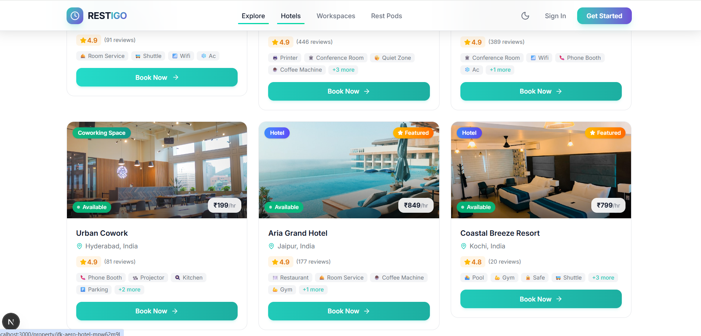
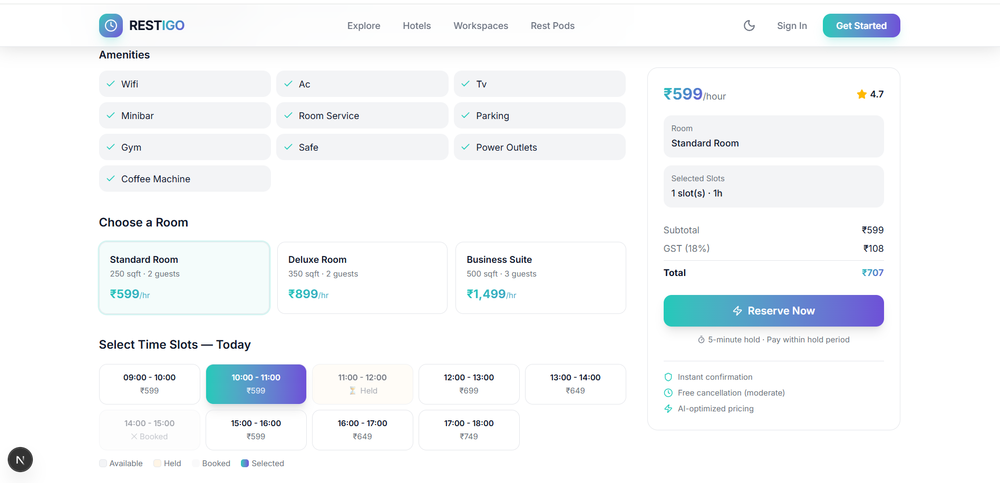

# RESTIGO 🏨

**AI-Powered Micro-Stay & Hourly Booking Platform**

RESTIGO revolutionizes the hospitality and workspace industry by allowing users to book premium hotel rooms, coworking spaces, nap pods, and meeting rooms strictly by the hour. 

## 📸 Screenshots






> **Note:** To display the screenshots above, please create a folder named `screenshots` inside `frontend/public/` and save your images there as `hero.png`, `search.png`, and `booking.png`.

## ✨ Key Features

- **Flexible Hourly Booking:** Book spaces for exactly how long you need them (1 to 24 hours).
- **AI-Powered Pricing Engine:** Dynamic pricing optimization based on demand, time of day, and availability.
- **Real-Time Inventory:** Live slots and availability tracking utilizing Redis and BullMQ.
- **Secure Authentication:** JWT-based authentication with seamless Google OAuth integration.
- **Premium UI/UX:** A stunning, highly responsive interface built with Next.js, Tailwind CSS, and Framer Motion.
- **Advanced Search & Filtering:** Text and geospatial search to find the perfect space instantly.

## 🛠️ Tech Stack

**Frontend:**
- Next.js 15 (App Router)
- React 19
- Tailwind CSS
- Framer Motion (Animations)
- Zustand (Global State Management)

**Backend:**
- Node.js & Express.js
- TypeScript
- MongoDB & Mongoose (Data Modeling)
- Redis & BullMQ (Task Queues & Caching)
- Passport.js (Google OAuth20 & Local Auth)
- JWT Authentication

## 🚀 Getting Started

### Prerequisites
- Node.js (v20+)
- MongoDB Atlas (or local instance)
- Redis Server

### 1. Backend Setup

```bash
cd backend
npm install
```

Create a `.env` file in the `backend` directory based on `.env.example` and add your database/redis/google credentials.

Run the seed script to populate the database with 150+ realistic properties and 25,000+ hourly slots:
```bash
npm run seed
```

Start the backend development server:
```bash
npm run dev
```

### 2. Frontend Setup

```bash
cd frontend
npm install
```

Start the frontend development server:
```bash
npm run dev
```

Open `http://localhost:3000` in your browser to explore RESTIGO!
